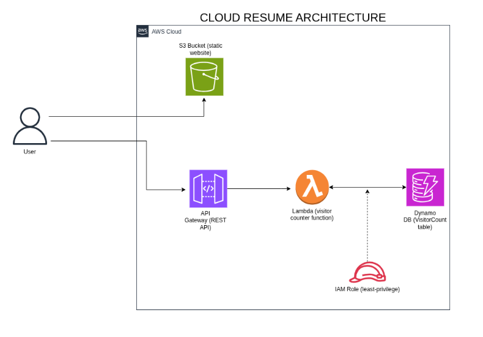

# Cloud Resume – Serverless Visitor Counter

 <!-- you'll add this later -->

A serverless web application that displays my resume and tracks visitor count using AWS Lambda, DynamoDB, API Gateway, and S3. Built with React and hosted on AWS.

## Live Demo

🔗 [victor-okoroafor-resume.s3-website-us-east-1.amazonaws.com](http://victor-okoroafor-resume.s3-website-us-east-1.amazonaws.com/)

## Architecture

The application consists of:

- **Frontend**: Static React app (built with Vite) hosted on Amazon S3.
- **Backend**: Python Lambda function that increments and returns a visitor count.
- **Database**: DynamoDB table (`VisitorCount`) with a single item storing the count.
- **API**: API Gateway REST endpoint triggers the Lambda function.

## Services Used

- **Amazon S3** – static website hosting
- **AWS Lambda** – serverless compute for visitor counter
- **Amazon DynamoDB** – persistent key‑value store
- **Amazon API Gateway** – exposes Lambda as a REST API
- **AWS IAM** – least‑privilege roles for Lambda

## What I Learned

- How to integrate a static frontend with a serverless backend
- Setting up IAM roles and permissions for Lambda
- Handling CORS issues with API Gateway
- Writing Infrastructure as Code (CloudFormation) – [planned]
- Deploying and testing a live AWS application

## Deployment Instructions

If you'd like to deploy your own version:

1. Clone this repo.
2. Install dependencies: `npm install`
3. Build the frontend: `npm run build`
4. Upload the contents of the `dist/` folder to an S3 bucket with static hosting enabled.
5. Create a DynamoDB table named `VisitorCount` with a primary key `id` (string).
6. Deploy the Lambda function (in `backend/` folder) with an IAM role that allows read/write to DynamoDB.
7. Create an API Gateway REST API with a GET method pointing to the Lambda.
8. Update the frontend JavaScript (in `src/components/Footer.tsx`) with your API endpoint URL.
9. Rebuild and re-upload the frontend.

## Future Improvements

- Add HTTPS with Amazon CloudFront
- Write a CloudFormation template to define the infrastructure as code
- Implement a contact form using another Lambda + SES
- Add unit tests for Lambda function

## Connect with Me

- [LinkedIn](https://www.linkedin.com/in/victor-okoroafor-cloud)
- [X (Twitter)](https://x.com/OkoroaforVic)
- [GitHub](https://github.com/vicGrey)
